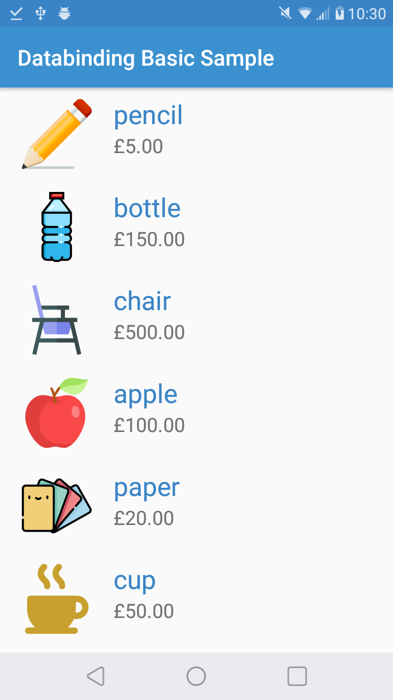

# Databinding with RecyclerView
This first sample is kept very simple so that you can concentrate on learning basics of databinding. It contains a single activity with two fragments: 
First fragment shows a list of items (hardcoded list of products) with a recyclerview, and the second fragment shows the details of the chosen product.
You can see databinding is used in both fragments and recyclerview items. Besides binding our views and getting rid of findViewById() calls, we also used data tags to pass product instances to the layout.
In item_product and fragment_details layouts you can see how fields of product objects are set to views in a declarative format, instead of setting them dynamically from java code. 

In item_product layout, you can also see the handling of item clicks from xml layout.

We also demonstrated use of a helper method inside xml layouts. In item_product and fragment_details layouts, you can see that we imported a utility class that hosts our helper method and
used that method in our views.

## Screenshots

  
   

#### Credits:
Icons in the DatabindingWithRecyclerview sample are made by Freepik from www.flaticon.com