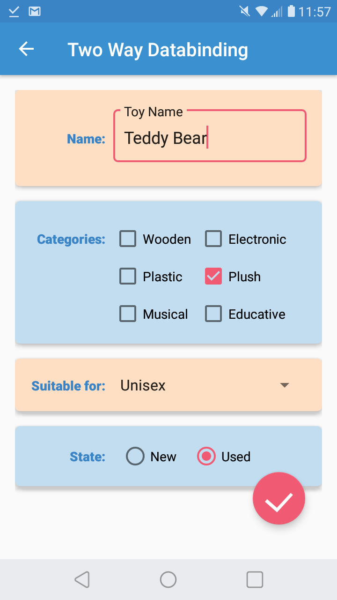
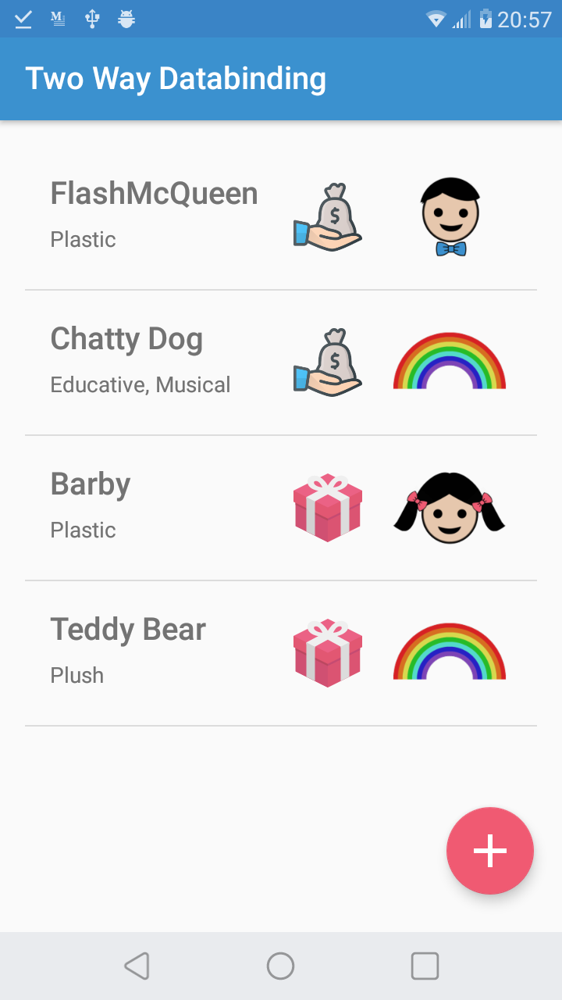

# Two-Way Databinding
This sample is designed to demonstrate two-way databinding. It's a simple inventory app, with the theme Toy Inventory. 
It contains a single activity with two fragments: First fragment shows the list of toys, whereas second fragment is used for adding or editing toys.
You can see the use of two-way databinding in AddToyFragment. We used edittext, checkboxes, radiobuttons and a spinner that all works two-way:
It shows the chosen toy when you're editting a toy, but it also listens for changes applied by the user. When you are entering a new entry, it is again listening for the changes simultaneously and keeps it in viewmodel. And all these without setting any listeners.If you have previously done an inventory app without databinding, you'd be surprised how this is done with very few code. 

The sample also makes use of some Android Architecture Components, like Viewmodel, Livedata and Room, together with a singleton repository.

## Screenshots

  
   
  

#### Credits:
Crying baby icon taken from: http://www.softicons.com/web-icons/baby-boy-icons-by-dapino/crying-baby-icon
Gift icon made by Pixel Buddha from www.flaticon.com
Money icon made by Those Icons from www.flaticon.com
